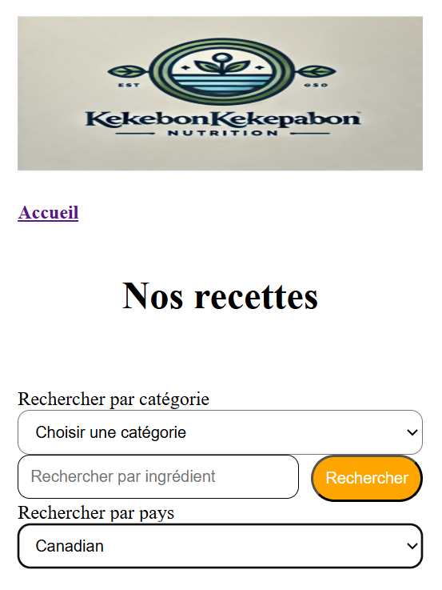

# ibis-project

## Rendu

## Instructions

1. Cliquez sur le bouton "Découvrez nos recetttes"
2. Choisir un pays/catégorie ou écrire un ingrédient (en anglais)
3. Cliquez sur une recette pour voir les instructions et ingrédients

## Organisation du code

1. Récupération des APIs dans des fichiers séparés
2. Fonction des détails
3. Eventlistener sur le bouton de validation
